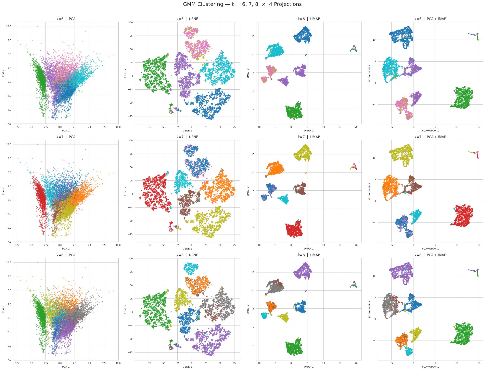
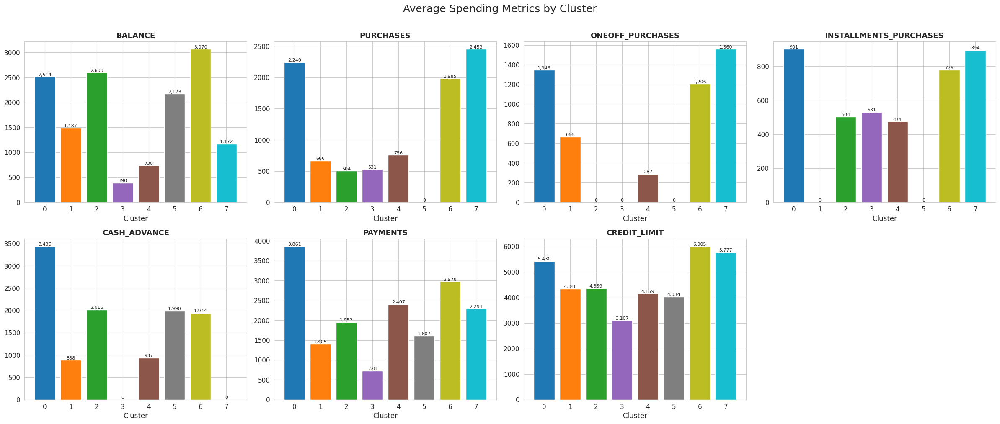

# 📊 Customer Segmentation — Credit Card Personalization


---

## 📌 Overview

This project applies unsupervised machine learning to segment ~9,000 active credit card holders into **8 distinct behavioral personas**. The analysis spans the full data science pipeline: from raw data exploration to an interactive business dashboard — enabling targeted marketing, risk profiling, and personalized financial services.

> **Dataset**: [Customer Segmentation — Credit Cards](https://www.kaggle.com/code/des137/customer-segmentation-credit-cards) (Kaggle)  
> **Key Algorithm**: Gaussian Mixture Models (GMM) with probabilistic cluster assignment

---

## 🗂️ Project Structure

```
.
├── customer-segmentation.ipynb     # Full analysis notebook
├── dashboard.py                    # Interactive Dash web app
├── customer_segmentation.csv       # Processed dataset with cluster labels
├── gmm_clustering_pipeline.joblib  # Saved GMM pipeline (for dashboard)
├── CC GENERAL.csv                  # Raw dataset
└── README.md
```

---

## 🔬 Analysis Pipeline

### 1 · Exploratory Data Analysis

The dataset contains **18 behavioral features** across three categories:

| Category | Features |
|---|---|
| **Monetary** | `BALANCE`, `PURCHASES`, `ONEOFF_PURCHASES`, `INSTALLMENTS_PURCHASES`, `CASH_ADVANCE`, `PAYMENTS`, `CREDIT_LIMIT` |
| **Frequency** | `PURCHASES_FREQUENCY`, `ONEOFF_PURCHASES_FREQUENCY`, `PURCHASES_INSTALLMENTS_FREQUENCY`, `CASH_ADVANCE_FREQUENCY` |
| **Behavioral** | `BALANCE_FREQUENCY`, `PRC_FULL_PAYMENT`, `MINIMUM_PAYMENTS`, `TENURE` |

Key findings from EDA:
- Heavy right-skew in all monetary features — necessitating log-transformation
- High correlation between `BALANCE` & `MINIMUM_PAYMENTS`, and `PURCHASES` & `ONEOFF_PURCHASES`
- ~3.5% missing values in `MINIMUM_PAYMENTS`, ~0.1% in `CREDIT_LIMIT`

#### 📈 Correlation Heatmap


---

### 2 · Preprocessing

| Step | Action |
|---|---|
| **Outlier Removal** | Capped at 95th percentile for high-value monetary features |
| **Missing Values** | Median imputation on `MINIMUM_PAYMENTS` and `CREDIT_LIMIT` |
| **Log Transform** | Applied to 6 monetary features to reduce skewness |
| **Scaling** | `StandardScaler` across all 15 remaining features |

---

### 3 · Finding the Optimal Number of Clusters

We evaluated **three methods** to determine the ideal *k*:

1. **Dendrogram (Hierarchical Clustering)** — suggested 7–9 natural breakpoints
2. **KMeans Elbow + Silhouette** — plateau around *k* = 8
3. **GMM BIC / AIC** *(primary method)* — minimum at *k* = 8

```
GMM k=6  BIC=1,042,318  AIC=1,025,760
GMM k=7  BIC=1,028,944  AIC=1,007,126
GMM k=8  BIC=1,019,371  AIC=992,091   ← optimal
```

---

### 4 · Gaussian Mixture Model Clustering

**Why GMM over KMeans?**  
KMeans assumes spherical, equal-size clusters. Real-world credit card behavior is **overlapping and non-spherical** — GMM handles this with ellipsoidal covariance matrices and **probabilistic soft assignment**.

**Configuration:**
```python
GaussianMixture(
    n_components=8,
    covariance_type='full',
    reg_covar=1e-6,
    random_state=42
)
```

The model is wrapped in a `sklearn.Pipeline` with `StandardScaler` for reproducible inference.

#### 🗺️ GMM Clusters — Model Selection (k = 6, 7, 8)
The chart below shows GMM output for each candidate *k*, projected onto t-SNE and UMAP 2D embeddings:



#### 🎯 Final GMM Segmentation (k = 8)
After fixing *k = 8*, projections confirm tight, well-separated clusters:


---

### 5 · DBSCAN (Supplementary)

DBSCAN was applied as a density-based cross-check to validate the GMM results and detect any noise/outlier points. Parameters were tuned via k-distance plots.

- **eps = 2.5**, **min_samples = 50**
- Result: 2 core clusters, ~2.8% noise — confirming GMM boundaries are sound

---

## 👥 Customer Personas

| # | Persona | Key Trait |
|---|---|---|
| 0 | 🏦 **The High-Rolling Transactors** | Max purchases, low balance — pay in full regularly |
| 1 | 😌 **The Passive Revolvers** | Low activity, carry old balances, rarely purchase |
| 2 | 💳 **The Credit-Stretched Installers** | Heavy installment use, stretched credit |
| 3 | 💵 **The Budget-Conscious Shoppers** | Low balance, small purchases, high payment rate |
| 4 | 📤 **The Balance Clearers** | Moderate spend, disciplined repayment |
| 5 | 🔥 **The Cash-Advance Dependents** | Frequent cash advances, high revolving balance |
| 6 | 🚨 **The Maxed-Out Borrowers** | Balances near credit limit, low payments |
| 7 | 💎 **The Premium Spenders** | High credit limit, high spend, low cash advance |

#### 📊 Cluster Size Distribution


#### 🌡️ Feature Intensity Heatmap (per cluster)


#### 📦 Spending Feature Distributions by Cluster


#### 🕸️ Radar Profile Overlay


---

## 💡 Business Recommendations

| Segment | Strategy |
|---|---|
| **Premium Spenders** | Offer premium rewards cards, travel perks, concierge services |
| **High-Rolling Transactors** | Loyalty cashback programs to retain high-value customers |
| **Cash-Advance Dependents** | Financial literacy outreach; short-term loan alternatives |
| **Maxed-Out Borrowers** | Proactive credit counselling and restructuring offers |
| **Budget-Conscious Shoppers** | Entry-level credit products with low interest and cashback |

---

## 🖥️ Interactive Dashboard

A Dash/Plotly dashboard provides real-time exploration of all 8 segments.

**Features:**
- **Overview Tab**: KPI cards, cluster size bar/pie charts
- **Cluster Deep Dive**: Per-cluster radar profile, vs-overall comparison, stats table
- **Data Explorer**: Filterable, sortable raw data view

**Run it:**
```bash
python3 dashboard.py
# Open http://127.0.0.1:8050
```

---

## ⚙️ Setup

```bash
# Clone & enter the project
git clone <repo-url>
cd customer-segmentation

# Install dependencies
pip install pandas numpy scikit-learn matplotlib seaborn \
            plotly dash joblib umap-learn

# Launch the notebook
jupyter notebook customer-segmentation.ipynb

# Or run the dashboard directly
python3 dashboard.py
```

---

## 🛠️ Tech Stack

| Tool | Purpose |
|---|---|
| Python 3.13 | Core language |
| Pandas / NumPy | Data manipulation |
| Scikit-learn | GMM, DBSCAN, preprocessing |
| UMAP-learn | Non-linear dimensionality reduction |
| t-SNE | Cluster visualization |
| Matplotlib / Seaborn | Static plots |
| Plotly / Dash | Interactive dashboard |
| Joblib | Model persistence |

---

*Developed as part of the **ITI ML-02** program — February 2026.*
